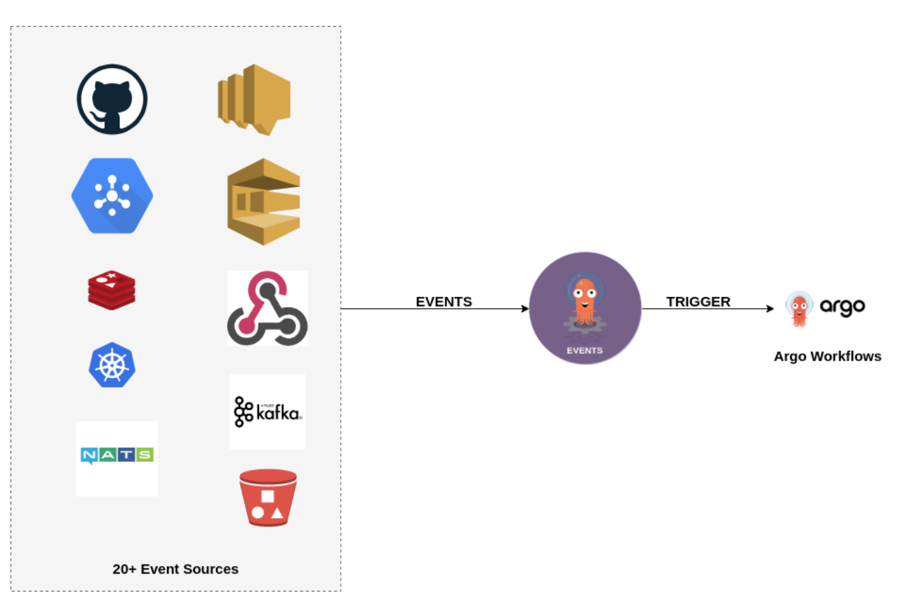
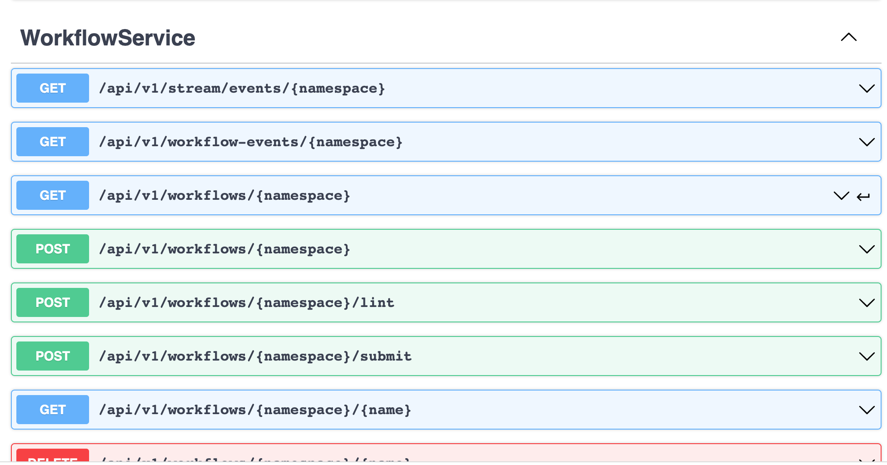
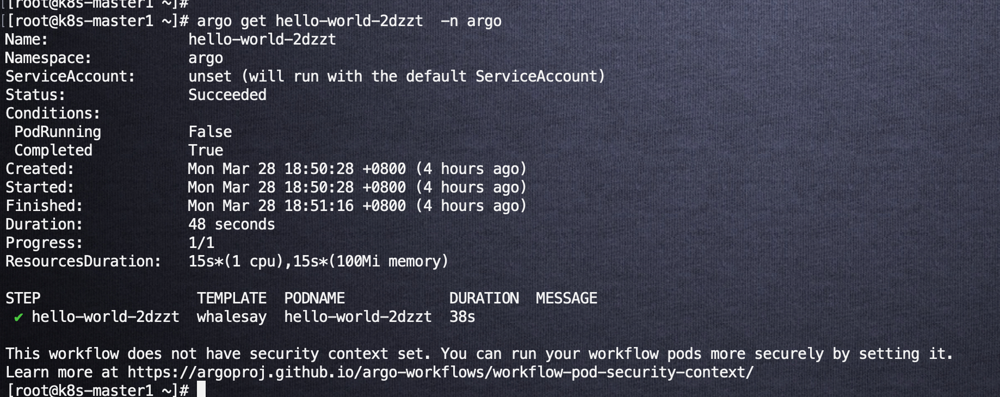

# argo workflow

## Argo Workflow Overview

## Argo Core Concepts

* **Workflow**: a Kubernetes resource defining the execution of one or more **template**. Workflows are named.
  
* **Template**: a **step**, **steps** or **dag**.  

* **Step**: a single step of a **workflow**, typically run a container based on **inputs** and capture the **outputs**.
  
* **Inputs**: **parameters** and **artifacts** passed to the **step**,
* **Outputs**: **parameters** and **artifacts** outputted by a **step**
  
* **Parameters**: objects, strings, booleans, arrays
  
* **Artifacts**: files saved by a container
* **Artifact Repository**: a place where **artifacts** are stored

* **Executor**: the method to execute a container, e.g. Docker, PNS ([learn more](https://argoproj.github.io/argo-workflows/workflow-executors/))

## Multiple Events Sources/ Trigger

## Workflow Notifications

There are a number of use cases where you may wish to notify an external system when a workflow completes:

1. Send an email.
2. Send a Slack (or other instant message).
3. Send a message to Kafka (or other message bus).

You have options:

1. For individual workflows, can add an exit handler to your workflow, [for example](https://raw.githubusercontent.com/argoproj/argo-workflows/master/examples/exit-handlers.yaml).
1. If you want the same for every workflow, you can add an exit handler to [the default workflow spec](default-workflow-specs.md).
1. Use a service (e.g. [Heptio Labs EventRouter](https://github.com/heptiolabs/eventrouter)) to the [Workflow events](workflow-events.md) we emit.

## Argo OpenAPI

详情[argo openapi-spec](https://github.com/argoproj/argo-workflows/blob/master/api/openapi-spec/swagger.json)

## Argo Mertics

