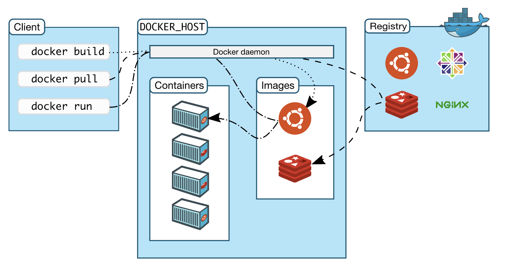
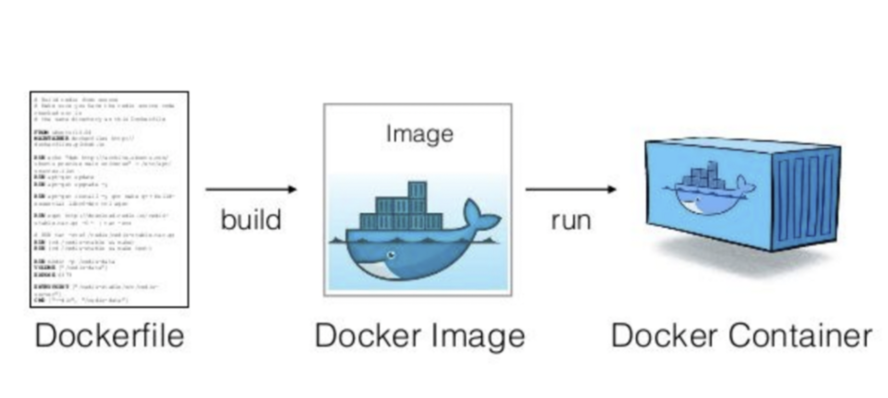
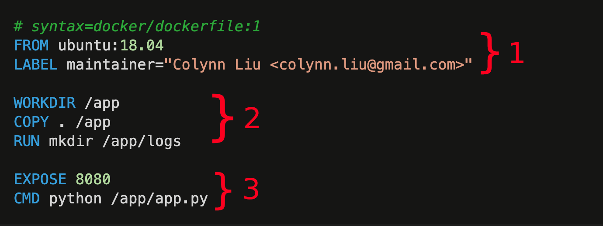

# Dockerfile详解

- [Dockerfile详解](#dockerfile详解)
  - [前置 - docker是什么](#前置---docker是什么)
  - [Dockerfile是什么](#dockerfile是什么)
    - [概述](#概述)
    - [如何使用](#如何使用)
  - [Dockerfile结构](#dockerfile结构)
    - [示例dockerfile](#示例dockerfile)
  - [Dockerfile语法格式](#dockerfile语法格式)
    - [.dockerignore file](#dockerignore-file)
  - [Dockerfile 常用命令](#dockerfile-常用命令)
    - [From/RUN](#fromrun)
      - [1. `FROM`](#1-from)
      - [2. `RUN`](#2-run)
    - [WORKDIR / ADD / COPY](#workdir--add--copy)
      - [1. `WORKDIR`](#1-workdir)
      - [2. `COPY`](#2-copy)
      - [3. `ADD`](#3-add)
    - [EXPOSE / CMD / ENTRYPOINT](#expose--cmd--entrypoint)
      - [1.EXPOSE](#1expose)
      - [2. CMD](#2-cmd)
      - [3. ENTRYPOINT](#3-entrypoint)
    - [ARG / ENV](#arg--env)
      - [1. ARG](#1-arg)
      - [2. ENV](#2-env)
    - [ONBUILD](#onbuild)
    - [Healthcheck](#healthcheck)
    - [Volume](#volume)
  - [Dockerfile 最佳实践](#dockerfile-最佳实践)
    - [Exclude with  `.dockerignore`](#exclude-with--dockerignore)
    - [Use multi-stage builds](#use-multi-stage-builds)
    - [Don’t install unnecessary packages](#dont-install-unnecessary-packages)
  - [自定义构建镜像](#自定义构建镜像)
  - [docker镜像的生成方式](#docker镜像的生成方式)
    - [方式](#方式)
  - [彩蛋 - BuildKit](#彩蛋---buildkit)

## 前置 - docker是什么

- Docker是一套平台即服务（PaaS）产品，它使用操作系统级的虚拟化，以容器的形式来交付软件。

- Docker的主要好处是它允许用户将一个应用程序及其所有的依赖关系打包成一个标准化的单元(容器)，用于软件开发、交付。与虚拟机不同，主机上所有的容器都共享一个操作系统内核的服务，从而能够更有效地利用底层系统和资源。
  
- 容器之间相互隔离，它们可以通过明确定义的通道相互通信。
  


## Dockerfile是什么

### 概述



- Docker可以通过读取`Dockerfile`中的指令自动构建镜像。
- `Dockerfile`是一个文本文件，定义从一个镜像开始，它包含了用户可以在命令行上调用的所有命令，最后可以通过`docker build` 组装成一个镜像。

### 如何使用

- 一般情况下，`Dockerfile`会使用执行`docker build`命令的根目录下的`Dockerfile`, 当前你也可以使用`-f`指定`Dockerfile`的路径

```sh
# Dockerfile use current root path
$ docker build . 

# Dockerfile use -f flag to point.
$ docker build -f /path/to/a/Dockerfile .
```

- 构建镜像时指定镜像的tag

```sh
# image default use latest tag
$ docker build -t shykes/myapp .

# image use 1.0.2 tag
$ docker build -t shykes/myapp:1.0.2 .

# 当前你也可以同时指定多个镜像tag
$ docker build -t shykes/myapp:1.0.2 -t shykes/myapp:latest .
```

_注_: docker守护程序在`Dockerfile`中运行指令之前，会先执行一个初步验证，如果语法不正确将会返回错误，结束运行。

## Dockerfile结构

### 示例dockerfile

```dockerfile
# syntax=docker/dockerfile:1
FROM ubuntu:18.04
LABEL maintainer="Colynn Liu <colynn.liu@gmail.com>"

WORKDIR /app
COPY . /app
RUN mkdir /app/logs

EXPOSE 8080
CMD python /app/app.py
```



注解：

1. Dockerfile 头信息
2. Dockerfile 命令集合
3. Dockerfile 运行时声明

## Dockerfile语法格式

```Dockerfile
# Comment
INSTRUCTION arguments
```

- Dockerfile命令是不区别大小写的，而我们习惯性用大写，因为这样可以更好与参数区别。

- Docker会按照顺序运行Dockerfile内的指令。__`Dockerfile`必须以`FROM`指令开始__,当然`FROM`也是可以在[解析器指令](https://docs.docker.com/engine/reference/builder/#parser-directives)、注释或是全局范围的[ARG](https://docs.docker.com/engine/reference/builder/#arg)之后。

_注_: [解析器指令](https://docs.docker.com/engine/reference/builder/#parser-directives)是可选的（很少用到），目前仅有`syntax`/`escape` 这两个解析器指令的定义。

### .dockerignore file

当使用 `ADD` or `COPY` . 时，为了避免将不需要的大文件或是敏感文件拷贝进容器，可以使用 `.dockerignore` 来忽略它们。

- 我们来看一个 `.dockerignore`的示例:

```sh
# comment
*/temp*    # eg: /somedir/temporary.txt
*/*/temp*  # eg: /somedir/subdir/temporary.txt
temp?      # eg: /tempa and /tempb
**/*.go    #
```

- 更多

```sh
*.md
!README*.md
README-secret.md
```

## Dockerfile 常用命令

### From/RUN

#### 1. `FROM`

```dockerfile
FROM [--platform=<platform>] <image> [AS <name>]
```

Or

```dockerfile
FROM [--platform=<platform>] <image>[:<tag>] [AS <name>]
```

Or

```dockerfile
FROM [--platform=<platform>] <image>[@<digest>] [AS <name>]
```

Tips:

- `FROM` can appear multiple times within a single Dockerfile to create multiple images
- Optionally a name can be given to a new build stage by adding `AS name` to the `FROM` instruction. The name can be used in subsequent `FROM` and `COPY --from=<name>` instructions to refer to the image built in this stage.
- The `tag` or `digest` values are optional. If you omit either of them, the builder assumes a `latest` tag by default. The builder returns an error if it cannot find the `tag` value.
- `ARG` is the only instruction that may precede `FROM` in the Dockerfile
- An `ARG` declared before a `FROM` is outside of a build stage(在构建阶段之外), so it can’t be used in any instruction after a `FROM`. To use the default value of an ARG declared before the first `FROM` use an `ARG` instruction without a value inside of a build stage:

  ```dockerfile
  ARG VERSION=latest
  FROM busybox:$VERSION
  ARG VERSION
  RUN echo $VERSION > image_version
  ```
  
#### 2. `RUN`

`RUN` has 2 forms:

- `RUN <command>` (shell form, the command is run in a shell, which by default is `/bin/sh -c` on Linux or `cmd /S /C` on Windows)
- `RUN ["executable", "param1", "param2"]` (exec form)

_Notes_:

1. The __exec form__ is parsed as a JSON array, which means that you must use double-quotes (`“`) around words not single-quotes (`‘`).
2. `RUN [ "echo", "$HOME" ]`与 `RUN [ "sh", "-c", "echo $HOME" ]` 有什么区别,一起来看下例子 [`./assets/dockerfile.run`](https://github.com/warm-native/docs/tree/master/docker/assets/dockerfile.run)
3. The cache for `RUN` instructions is validated automatically during the next build. `docker build`时可以添加 `--no-cache`来解除缓存， 当然也可以通过`COPY`、`ADD`指令来使缓存无效。

### WORKDIR / ADD / COPY

#### 1. `WORKDIR`

`WORKDIR`为`Dockerfile`中的`RUN`, `CMD`, `ENTRYPOINT`, `COPY`, `ADD`指令设置工作目录，如果不存在将会被创建（即使后面没有使用这个工作目录），允许多次定义，也允许使用相对路径，也可以解析之前通过`ENV`设置的路径。

_注_:

  1. 使用相对路径时会相对之前的`WORKDIR`指令来创建，如果是首次创建，也就是在根目录`/`.
  2. 为了`Dockerfile`的易维护性，建议`WORKDIR`只声明一次.

#### 2. `COPY`

```dockerfile
COPY [--chown=<user>:<group>] <src>... <dest>
COPY [--chown=<user>:<group>] ["<src>",... "<dest>"]
```

_注_: 如果路径中包含空格只能采用第二种方式

`COPY` obeys the following rules:

- `<src>` 目录必须在构建的上下文内; 你不能执行类似于这样的：`COPY ../something /something`
- 如果 `<src>` 是一个目录，这个目录下的全部内容均会拷贝进入(__注意__: 目录本身并不会拷贝，只会拷贝目录下的内容)

- 如果 `<src>` 是任何类型的文件.
  - 如果 `<dest>` 以 `/`结尾，则`<dest>`将会作为目录，`<src>`的目录将会拷贝至 `<dest>`目录之下;
  - 如果`<dest>` 不以`/`结尾，则`<dest>`会被覆盖成`<src>`的内容。

- 如果多个 `<src>` 资源被指定时，（不管是文件/目录或是使用通配符的资源）,  `<dest>` 必须是一个目录，也就是说必须依赖 `/`结尾； 另外如果拷贝多个资源时，`<dest>` 不以`/`结尾， builder也提示语法错误。

- 如果 `<dest>` 不存在, 它将和其路径中所有缺失的目录一起被创建。

#### 3. `ADD`

```dockerfile
ADD [--chown=<user>:<group>] <src>... <dest>
ADD [--chown=<user>:<group>] ["<src>",... "<dest>"]
```

`ADD`相对于`COPY`更强大：

- It can handle remote URLs
- It can also auto-extract tar files.

`ADD` obeys the following rules:

- 如果 `<src>` 是一个URL,
  - 如果 `<dest>` 不是以`/`结尾, 则`<dest>`会被覆盖成`<src>`的内容.
  - 如果 `<dest>` 以 `/`结尾，则`<dest>`将会作为目录，`<src>`的目录将会拷贝至 `<dest>`目录之下;
  - `[Waring]` The URL must __have a nontrivial path__ so that an appropriate filename can be discovered in this case (`http://example.com` will not work).

- 如果 `<src>` 是一个本地的`tar`包(identity, gzip, bzip2 or xz), 它会被解压为一个目录. When a directory is copied or unpacked, it has the same behavior as `tar -x`.
  - `[Note]` Resources from remote URLs are not decompressed.
  - 将一个`<src>`是否判断为压缩包是依赖文件的内容，而不是文件的名称，比如你直接`ADD hello.tar.gz  /`, 只是会将这个文件拷贝进去，并不会解压也不会报错。

### EXPOSE / CMD / ENTRYPOINT

#### 1.EXPOSE

- 格式

```sh
EXPOSE <port> [<port>/<protocol>...]
```

```sh
# the default is TCP if the protocol is not specified.
EXPOSE 80/tcp
EXPOSE 80/udp
```

- `EXPOSE` 指令不是确切的发布的端口， It functions as a type of documentation __between__ the person who builds the image __and__ the person who runs the container, about which ports are intended to be published.

- 运行容器真正发布的端口，其实是通过`docker run`添加`-p`的参数来发布和映射一个或多个端口，或是使用`-P` 发布`EXPOSE`声明的端口并将其映射到高阶端口上。

#### 2. CMD

The CMD instruction has three forms:

- `CMD ["executable","param1","param2"]` (exec form, this is the preferred form)
- `CMD ["param1","param2"]` (as default parameters to ENTRYPOINT)
- `CMD command param1 param2` (shell form)

概述:

- 在`Dockerfile`中只能有一个`cmd`指令, 如果你定义了很多，只有最后一下能够起作用.

- __The main purpose of a `CMD` is to provide defaults for an executing container.__ 这个默认值可以被执行，或是指定一个`ENTRYPOINT'指令来忽略.
- `CMD`是第二种方式运行时（为`ENTRYPOINT`提供默认的参数）, `CMD` 和 `ENTRYPOINT` 均应该是 `JSON`格式.
- If the user specifies arguments to `docker run` then they will override the default specified in `CMD`. eg: `docker run -it --rm colynn/ops-debug /bin/sh`

Tips:

- Do not confuse `RUN` with `CMD`. `RUN` actually runs a command and commits the result; `CMD`在构建时不执行任何东西，但指定镜像的预期命令。
- 大家可以看到`CMD`也是存在`exec`、`shell`模型的，所以也存在类似于`RUN`的变量解析的问题。

#### 3. ENTRYPOINT

The ENTRYPOINT instruction has two forms:

- `ENTRYPOINT ["executable", "param1", "param2"]`  # exec form
- `ENTRYPOINT command param1 param2`   # shell form

Tips:

- Only the last `ENTRYPOINT` instruction in the `Dockerfile` will have an effect.
- The __exec form__ is parsed as a JSON array, which means that you must use double-quotes (“) around words not single-quotes (‘)
- 类似`RUN`/`CMD` , `ENTRYPOINT [ "echo", "$HOME" ]` will not do variable substitution on `$HOME`
- __shell form__ You can specify a plain string for the `ENTRYPOINT` and it will execute in `/bin/sh -c`. This form will use shell processing to substitute shell environment variables, and will ignore any `CMD` or `docker run` command line arguments.
- 所以在 __shell form__ 下，为了确保`docker stop`能够正确停止ENTRYPOINT的可执行程序，记得用exec启动它， eg: `ENTRYPOINT exec top -b` ?, 其实写一个测试代码发现不论是加不加`exec` [测试代码](https://github.com/warm-native/docs/tree/master/docker/codes/execsignal)均可以收到 `SIGTERM` 信号，这个点值得我们再去[讨论](https://github.com/docker/cli/issues/3198)，

### ARG / ENV

#### 1. ARG

The ARG instruction defines a variable that users can pass at build-time to the builder with the docker build command using the `--build-arg <varname>=<value>` flag. If a user specifies a build argument that was not defined in the Dockerfile, the build outputs a warning.

1. Default values/Scope
  
  ```Dockerfile
  FROM busybox
  ARG user1=someuser
  ARG buildno=1

  USER ${user:-some_user}
  ARG user
  USER $user
  # ...
  ```

2. Predefined ARGs

- `HTTP_PROXY`
- `http_proxy`
- `HTTPS_PROXY`
- `https_proxy`
- `FTP_PROXY`
- `ftp_proxy`
- `NO_PROXY`
- `no_proxy`

3. How to use

```sh
docker build --build-arg HTTPS_PROXY=https://my-proxy.example.com .
```

#### 2. ENV

语法:

```Dockerfile
ENV <key>=<value> ...
ENV MY_VAR my-value
```

示例：

```Dockerfile
ENV MY_NAME="John Doe"
ENV MY_DOG=Rex\ The\ Dog
ENV MY_CAT=fluffy
```

Tips:

- `ENV` which is persisted in the final image
- `ARG` which is not persisted in the final image
  
### ONBUILD

```dockerfile
ONBUILD <INSTRUCTION>
```

举个例子：

- 场景：
  
如果你的镜像是一个可重复使用的`python`应用程序构建器，那就需要应用的代码添加至指定的目录，而且再添加完代码后，可能还需要一个构建脚本被触发；
因为你没有应用代码的权限，而且对于每个应用的构建也有可能不同。

- 解决办法：
  
你可以提供一个`Dockerfile`的模板给开发者，但是这样是很不高效的，而且应用的代码混合在一起，有错误也难以更新。

- 最优解

如下面的命令，使用`ONBUILD`来注册提前指令，以便在以后的下一个构建阶段运行。

```dockerfile
ONBUILD ADD . /app/src
ONBUILD RUN /usr/local/bin/python-build --dir /app/src
```

### Healthcheck

- `HEALTHCHECK [OPTIONS] CMD command` (check container health by running a command inside the container)
- `HEALTHCHECK NONE` (disable any healthcheck inherited from the base image)

作用：

`HEALTHCHECK` 指令告诉Docker如何测试一个容器，以检查它是否仍在工作。比如网络服务器陷入了无限循环，无法处理新的连接，尽管服务器进程仍在运行。

The options that can appear before `CMD` are:

- `--interval=DURATION` (default: `30s`)
- `--timeout=DURATION`  (default: `30s`)
- `--start-period=DURATION` (default: `0s`)
- `--retries=N` (default: `3`)

The command's exit status indicates the health status of the container. The possible values are:

- 0: success - the container is healthy and ready for use
- 1: unhealthy - the container is not working correctly
- 2: reserved - do not use this exit code

示例：

```dockerfile
HEALTHCHECK --interval=5m --timeout=3s \
  CMD curl -f http://localhost/ || exit 1
```

### Volume

```dockerfile
VOLUME ["/data"]
```

The `VOLUME` instruction creates a mount point with the specified name and marks it as holding externally mounted volumes from native host or other containers.

Notes about specifying volumes:

- __You cannot specify a volume source in the `Dockerfile`__:
- __What does the VOLUME line do?__:  Every time you create a container from this image, docker will force that directory to be a volume. If you do not provide a volume in your run command, or compose file, the only option for docker is to create __an anonymous volume__.
- __Changing the volume from within the Dockerfile__: If any build steps change the data within the volume after it has been declared, those changes will be discarded.
- __The host directory is declared at container run-time__: The host directory (the mountpoint) is, by its nature, host-dependent. This is to preserve image portability, since a given host directory can’t be guaranteed to be available on all hosts. For this reason, you can’t mount a host directory from within the Dockerfile. The VOLUME instruction does not support specifying a host-dir parameter. You must specify the mountpoint when you create or run the container.

如果这个镜像你的应用镜像，你不再把它作为基础镜像继续使用的话，`volume`在`dockerfile`的场景可以简单概述下：

- 适合的场景(logs、temp folders) ，
- 不适合的场景（static files, configs, code）

其实，对于`logs`、`temp folders`可以基于存放于`write layer`层，或是对于需要保存的通过`docker run`或是`docker-compose`的方式声明`volume`更好些。

## Dockerfile 最佳实践

- <https://docs.docker.com/develop/develop-images/dockerfile_best-practices/>
  
### Exclude with  `.dockerignore`

### Use multi-stage builds

- <https://docs.docker.com/develop/develop-images/multistage-build/>

### Don’t install unnecessary packages

Each instruction you create in your Dockerfile results in a new image layer being created. Each layer brings additional data that are not always part of the resulting image. For example, if you add a file in one layer, but remove it in another layer later, the final image’s size will include the added file size in a form of a special "whiteout" file although you removed it. In addition, every layer contains separate metadata that add up to the overall image size as well.

## 自定义构建镜像

- <https://github.com/warm-native/docs/blob/master/topic001/README.md>
  
- <https://docs.docker.com/develop/develop-images/baseimages/>

## docker镜像的生成方式

我们所说的`Docker images` 实际上是由一个或是多个镜像层构建的。 镜像中的层是以父子关系连接在一起的，每个层代表最终容器图像的某些部分。

### 方式

- 通过docker容器生成镜像
- 通过dockerfile生成镜像；

## 彩蛋 - BuildKit

  ```sh
  export  DOCKER_BUILDKIT=1
  ```

### Differences between legacy builder and BuildKit

The legacy Docker Engine builder processes all stages of a Dockerfile leading up to the selected `--target`. It will build a stage even if the selected target doesn’t depend on that stage.

[BuildKit(](https://docs.docker.com/build/buildkit/) only builds the stages that the target stage depends on.

For example, given the following Dockerfile:

```dockerfile
# syntax=docker/dockerfile:1
FROM ubuntu AS base
RUN echo "base"

FROM base AS stage1
RUN echo "stage1"

FROM base AS stage2
RUN echo "stage2"
```

With [BuildKit enabled](https://docs.docker.com/build/buildkit/#getting-started), building the __stage2__ target in this Dockerfile means only _base_ and _stage2_ are processed. There is no dependency on _stage1_, so it’s skipped.
