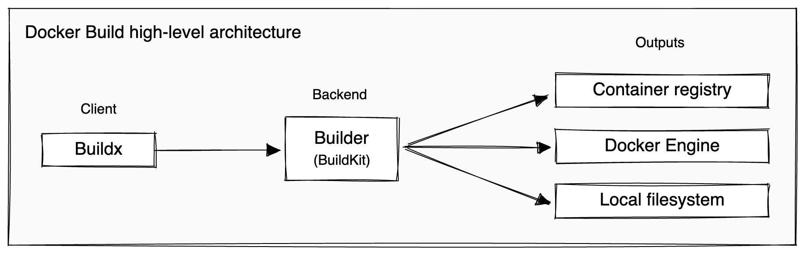

# multi-arch

## 写在前面

### Docker Build architecture

Docker Build implements a client-server architecture, where:

- Buildx is the client and the user interface for running and managing builds
- BuildKit is the server, or builder, that handles the build execution.


> As of Docker Engine 23.0 and Docker Desktop 4.19, Buildx is the default build client.

There are currently __four different ways__ that one can build locally with Docker:

- The legacy builder in Docker Engine: `DOCKER_BUILDKIT=0 docker build .`
- BuildKit in Docker Engine: `DOCKER_BUILDKIT=1 docker build .`
- Buildx CLI plugin with the Docker driver: `docker buildx build .`
- Buildx CLI plugin with the Container driver: `docker buildx create && docker buildx build .`

## Without Using Docker BuildX

```sh
export DOCKER_CLI_EXPERIMENTAL=enabled

docker manifest create

docker manifest push
```

## buildx

<https://github.com/docker/buildx>

### Buildx CLI with driver

<https://github.com/docker/buildx/blob/master/docs/reference/buildx_create.md#-set-the-builder-driver-to-use---driver>

[Set buildx as default builder](https://github.com/docker/cli/pull/3314)

[Docker container build driver](https://docs.docker.com/build/drivers/docker-container/)

## buildKit

## 应用

如上我们了解到了 buildx、buildKit, 那么如何在自己的环境内使用呢？以下载[buildx v0.13.1](https://github.com/docker/buildx/releases/tag/v0.13.1)为例：

```sh
mkdir ~/.docker/cli-plugins/

wget https://github.com/docker/buildx/releases/download/v0.13.1/buildx-v0.13.1.linux-amd64  -O docker-buildx

chmod +x docker-buildx

docker info 
```

## golang project sample

<https://gist.github.com/AverageMarcus/78fbcf45e72e09d9d5e75924f0db4573>

## java project sample
