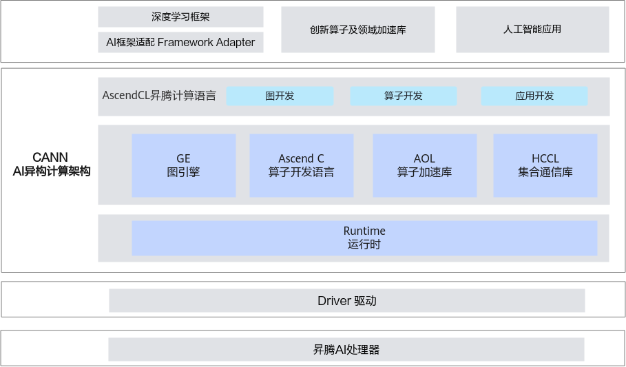
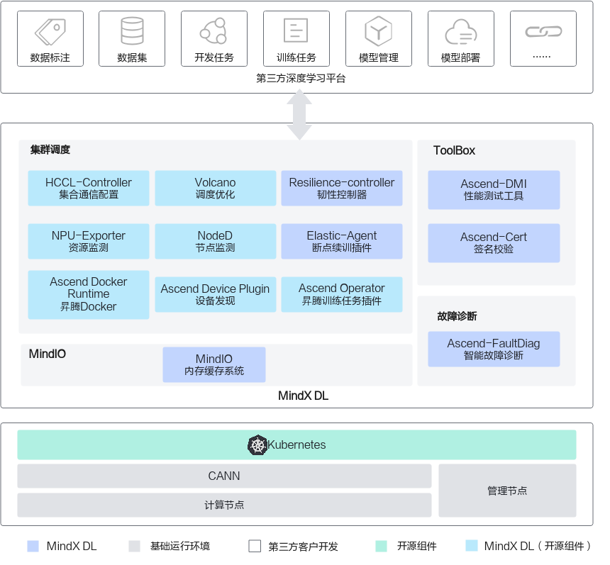
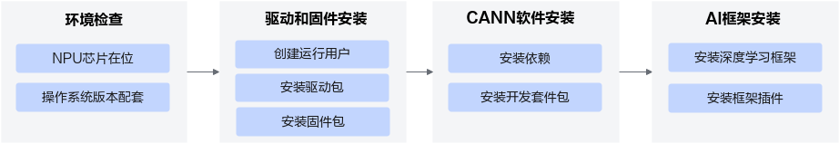
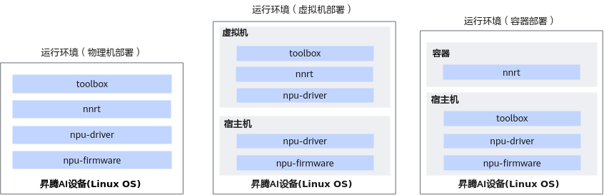
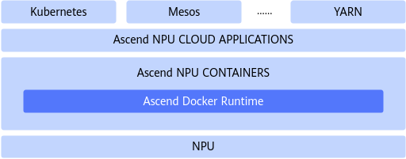
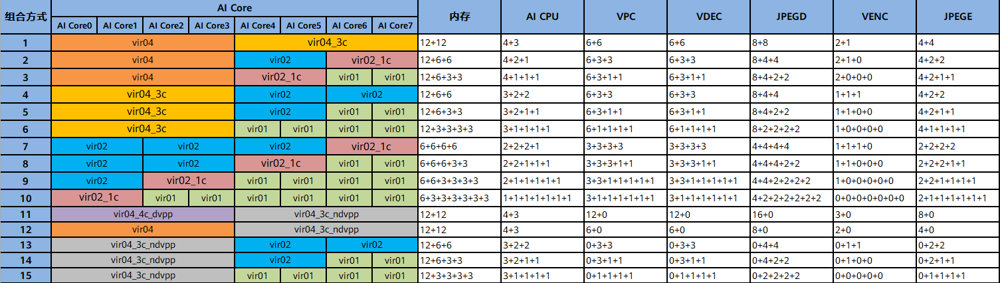
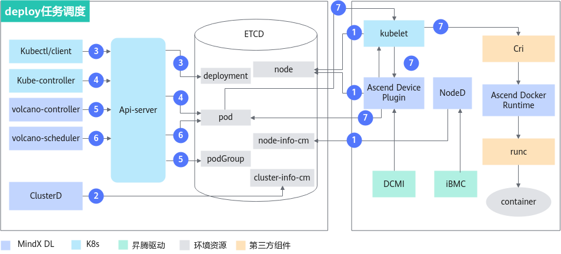

# atlas300V Pro run on Kubernetes

- [atlas300V Pro run on Kubernetes](#atlas300v-pro-run-on-kubernetes)
  - [前言](#前言)
  - [环境信息](#环境信息)
    - [硬件信息](#硬件信息)
    - [软件信息](#软件信息)
  - [名词解释](#名词解释)
    - [CANN 异构计算架构](#cann-异构计算架构)
      - [总体架构](#总体架构)
    - [MindX DL组件](#mindx-dl组件)
  - [组件安装](#组件安装)
    - [概述](#概述)
    - [安装驱动及固件](#安装驱动及固件)
    - [安装toolbox](#安装toolbox)
      - [下载链接](#下载链接)
    - [安装容器化支持](#安装容器化支持)
  - [集群调度(Kubernetes)](#集群调度kubernetes)
    - [安装部署](#安装部署)
      - [通用操作](#通用操作)
      - [Ascend Device Plugin 镜像](#ascend-device-plugin-镜像)
      - [Ascend for volcano 镜像](#ascend-for-volcano-镜像)
      - [下载chart包](#下载chart包)
    - [至此结束了](#至此结束了)
  - [虚拟化](#虚拟化)
    - [应用场景及方案](#应用场景及方案)
    - [虚拟化规则](#虚拟化规则)
    - [使用约束](#使用约束)
    - [静态虚拟化](#静态虚拟化)
      - [创建vNPU](#创建vnpu)
      - [销毁指定vNPU](#销毁指定vnpu)
      - [挂载vNPU](#挂载vnpu)
    - [动态虚拟化](#动态虚拟化)
      - [如何使用](#如何使用)
  - [资源监测](#资源监测)
    - [前置条件](#前置条件)
      - [npu-exporter镜像](#npu-exporter镜像)
        - [面板](#面板)
  - [命令行的使用](#命令行的使用)
    - [写在前面](#写在前面)
    - [命令行使用示例](#命令行使用示例)
  - [npu服务的Dockerfile声明](#npu服务的dockerfile声明)

## 前言

随着国产化信创的要求，对于arm形态（鲲鹏架构）的atlas NPU卡做了些适配改造的工作，由于前期对于国产化硬件了解不多，导致踩了很多坑，所以今天就一起梳理下，如果你也刚好有这个需求，不妨接着往下看，期望对你会有些收获。

对于Atlas系列的硬件，有加速卡、服务器、开发者套件等，我们此文只讨论加速卡，对于atlas的推理、训练服务器我们不涉及，当然不管你是采购的何种型号的服务器，只要你使用的AI加速卡也是Atlas 那你就可以继续阅读，（不同型号或是规格的服务器可能导致你可使用的加速卡的种类和个数不同而已。）

[Ascend官网](https://www.hiascend.com)的文档其实比较全面，但是因为相对有些分散（涉及到很多的名词，默认值并没有按照前后逻辑一步步说明清楚），所以本篇文档的作用更多的是一个串联，可以让你更好的去阅读Ascend社区的相关文档。

## 环境信息

### 硬件信息

- Atlas 800 推理服务器（型号：3000）：  CPU: 鲲鹏920*2 / AI加速卡: 2个Atlas 300V Pro
- KunLun G2289 GPU服务器：  CPU: 鲲鹏920*2 / AI加速卡: 2个Atlas 300I Duo

> Atlas 800 推理服务器（型号：3000）: 是基于鲲鹏920与昇腾310芯片的AI推理服务器，最大可支持8个Atlas 300I/V Pro,提供强大的实时推理能力和视频分析能力，广泛应用于中心侧AI推理场景。

> KunLun G2280 GPU服务器: 一是款2U2路的GPU服务器，是基于鲲鹏920与昇腾310芯片的AI推理服务器，最大可支持8个Atlas 300I/V Pro推理卡，为深度学习和推理提供强大算力，广泛应用于中心侧AI推理如智慧城市、智慧交通、智慧金融等多场景。

> AI加速卡 Atlas 300V Pro ([规格详情](https://support.huawei.com/enterprise/zh/doc/EDOC1100209004/e6767cc0)) 与Atlas 300I Duo卡均是配置的Ascend 310P AI处理器产品规格，对于ascend AI芯片想了解更多请点击[这里](https://zhuanlan.zhihu.com/p/662674649), 另外我们只有使用了昇腾的AI加速卡，其他的可以通过[昇腾AI产品形态说明](https://www.hiascend.com/document/detail/zh/canncommercial/700/productform/hardwaredesc_0001.html)或是[昇腾官网产品页了解](https://www.hiascend.com/zh/ecosystem/industry)

### 软件信息

- OS: OpenEuler 23.04
- Kubernetes: v1.20.11
- Docker: 26.1.2

对于操作系统的磁盘分区略过，可参看[这里](https://www.hiascend.com/document/detail/zh/mindx-dl/60rc1/clusterscheduling/clusterschedulingig/dlug_installation_006.html#ZH-CN_TOPIC_0000001882784853__section02091655142310)

## 名词解释

### CANN 异构计算架构

异构计算架构CANN（Compute Architecture for Neural Networks）是华为针对AI场景推出的异构计算架构，向上支持多种AI框架，包括MindSpore、PyTorch、TensorFlow等，向下服务AI处理器与编程，发挥承上启下的关键作用，是提升昇腾AI处理器计算效率的关键平台。同时针对多样化应用场景，提供多层次编程接口，支持用户快速构建基于昇腾平台的AI应用和业务。

#### 总体架构

CANN提供了功能强大、适配性好、可自定义开发的AI异构计算架构, 更多请访问[官网链接](https://www.hiascend.com/document/detail/zh/canncommercial/80RC1/quickstart/quickstart/quickstart_18_0003.html)



### MindX DL组件

MindX DL（昇腾深度学习组件）是支持 Atlas训练卡、推理卡的深度学习组件，提供昇腾 AI 处理器集群调度、昇腾 AI 处理器性能测试、模型保护等基础功能，快速使能合作伙伴进行深度学习平台开发, 更多请参加[官方文档](https://www.hiascend.com/document/detail/zh/mindx-dl/60rc1/description/productdescription/dlug_description_001.html)



## 组件安装

### 概述

我们先整体看下开发运行环境的搭建流程，如下图


注解：『环境检查』我们这篇文章就先略过，重点在『驱动和固件安装』这个步骤，因为我们实际的运行环境是在kubernetes平台上的容器内，所以还要再添加上容器化环境准备的步骤（也就是部署『MindX DL』相关的组件）， 对于『CANN软件安装』的步骤也就内化到运行的容器内了。

对于不同形态(物理机/虚拟机/容器)的运行环境安装的组件也会有些差异，我再补充一张图，[原图在这里](https://www.hiascend.com/document/detail/zh/canncommercial/700/envdeployment/instg/instg_0060.html)



### 安装驱动及固件

- [原文链接](https://www.hiascend.com/document/detail/zh/CANNCommunityEdition/80RC2alpha003/quickstart/quickstart/quickstart_18_0005.html)

下载对应版本的驱动及固件，说明『社区版』/『商用版』软件版本上没有区别??，

Atlas 300V pro加速卡的社区版本[下载链接示例](https://www.hiascend.com/hardware/firmware-drivers/community?product=2&model=16&cann=8.0.RC2.alpha003&driver=1.0.22.alpha)

- Ascend-hdk-310p-npu-driver
- Ascend-hdk-310p-npu-firmware

```sh
# 驱动及固件安装 
# 下载驱动及固件至服务器

# 创建驱动运行用户HwHiAiUser。
groupadd -g HwHiAiUser
useradd -g HwHiAiUser -d /home/HwHiAiUser -m HwHiAiUser -s /bin/bash

# 增加对软件包的可执行权限。
chmod +x Ascend-hdk-<soc_version>-npu-driver_23.0.2_linux-x86-64.run
chmod +x Ascend-hdk-<soc_version>-npu-firmware_7.1.0.4.220.run

# 执行如下命令，校验安装包的一致性和完整性。
./Ascend-hdk-<soc_version>-npu-driver_23.0.2_linux-x86-64.run --check
./Ascend-hdk-<soc_version>-npu-firmware_7.1.0.4.220.run --check

# 执行如下命令安装驱动。
./Ascend-hdk-<soc_version>-npu-driver_23.0.2_linux-x86-64.run --full --install-for-all

# 出现类似如下回显信息，说明安装成功。
# Driver package installed successfully!

# 执行如下命令安装固件。
./Ascend-hdk-<soc_version>-npu-firmware_7.1.0.4.220.run --full

#出现类似如下回显信息，说明安装成功。
Firmware package installed successfully! Reboot now or after driver installation for the installation/upgrade to take effect

# 驱动和固件安装完成后，重启系统。
systemctl reboot
```

> 对于『CANN软件安装』步骤如上面我们所提及的，调整至容器的`Dockerfile`来完成声明安装。

- Ascend-hdk-310p-mcu

- Ascend-mindx-toolbox
- Ascend-cann-nnrt-6.0.2.1  [安装文档](https://www.hiascend.com/document/detail/zh/canncommercial/700/envdeployment/instg/instg_0060.html)

- Ascend-docker-runtime

### 安装toolbox

#### 下载链接

<https://www.hiascend.com/zh/developer/download/community/result?module=dl+cann>

安装过程可直接参考官方文档[链接](https://www.hiascend.com/document/detail/zh/mindx-dl/60rc1/toolbox/ascenddmi/toolboxug_0004.html)

### 安装容器化支持

__Ascend Docker Runtime__（又称Ascend Docker，又称昇腾容器运行时）是MindX DL的基础组件，用于为所有的训练或推理作业提供昇腾AI处理器（Ascend NPU）容器化支持，使用户AI作业能够以Docker容器的方式平滑运行在昇腾设备之上，Ascend Docker Runtime逻辑接口如下图所示。



安装Ascend Docker Runtime 可直接参看[文档](https://www.hiascend.com/document/detail/zh/mindx-dl/60rc1/clusterscheduling/dockerruntimeug/dlruntime_ug_006.html)

至此，你就已经具备了docker客户端的方式来启动自己的npu计算类服务了, 更多的可以参看官方文档[链接](https://www.hiascend.com/document/detail/zh/mindx-dl/60rc1/clusterscheduling/dockerruntimeug/dlruntime_ug_011.html)

## 集群调度(Kubernetes)

集群调度组件基于业界流行的集群调度系统Kubernetes，增加了昇腾AI处理器（下文出现的NPU表示昇腾AI处理器）的支持，提供昇腾AI处理器资源管理和查看、优化调度和分布式训练集合通信配置等基础功能。深度学习平台开发厂商可以有效减少底层资源调度相关软件开发工作量，快速使能合作伙伴基于MindX DL开发深度学习平台。

- 官方[文档链接](https://www.hiascend.com/document/detail/zh/mindx-dl/60rc1/clusterscheduling/clusterschedulingsd/dl_present_001.html)

### 安装部署

我们基于手动安装的方式来部署，参考[获取软件包链接](https://www.hiascend.com/document/detail/zh/mindx-dl/60rc1/clusterscheduling/clusterschedulingig/dlug_installation_010.html), 根据需要启用的功能部署相应的MindX DL组件，并非所有的软件包均需要下载安装。

下面我只能基于我们使用的功能来对『安装部署』做一个说明，本实践我们只是基于动态虚拟化实现集群调度，所以只需要部署Ascend Docker Runtime、Ascend Device Plugin、Volcano三个组件。

『安装容器化支持』的步骤时我们已经说明了`Ascend Docker Runtime`的安装部署过程，对于另外两个组件可以通过上面的[软件包链接](https://www.hiascend.com/document/detail/zh/mindx-dl/60rc1/clusterscheduling/clusterschedulingig/dlug_installation_010.html)选择下载，也可以直接通过ascend社区的gitee group来选择相应的版本来下载安装.

#### 通用操作

在安装两个组件前，在对应的安装节点上我们需要执行如下 [__通用操作__](https://www.hiascend.com/document/detail/zh/mindx-dl/60rc1/clusterscheduling/clusterschedulingig/dlug_installation_015.html)
> 说明：只列举目前操作，其他操作会包含在chart包实现，请配合下文的chart包链接一起测试实践。

1. 创建节点标签

```sh
# 因为我们使用的均是Ascend 310P AI处理器，所以选择如下标签
kubectl label nodes 主机名称 node-role.kubernetes.io/worker=worker
kubectl label nodes 主机名称 workerselector=dls-worker-node
kubectl label nodes 主机名称 host-arch=huawei-arm或host-arch=huawei-x86
kubectl label nodes 主机名称 accelerator=huawei-Ascend310P
```

> 如果你是其他的产品类型，可根据[链接](https://www.hiascend.com/document/detail/zh/mindx-dl/60rc1/clusterscheduling/clusterschedulingig/dlug_installation_014.html)选择.

2. 创建用户

```sh
# HwHiAiUser是驱动或CANN软件包需要的软件运行用户.
# ubuntu操作系统
useradd -d /home/hwMindX -u 9000 -m -s /usr/sbin/nologin hwMindX
usermod -a -G HwHiAiUser hwMindX

# CentOS操作系统
useradd -d /home/hwMindX -u 9000 -m -s /sbin/nologin hwMindX
usermod -a -G HwHiAiUser hwMindX
```

> 更多关于组件用户的说明参看[链接](https://www.hiascend.com/document/detail/zh/mindx-dl/60rc1/clusterscheduling/clusterschedulingig/dlug_installation_015.html)

3. 命名空间

不要随意改变命名空间，请参看[文档要求](https://www.hiascend.com/document/detail/zh/mindx-dl/60rc1/clusterscheduling/clusterschedulingig/dlug_installation_017.html), 因为看代码有些命名空间已经固定为常量了，所以不要随意切换命名空间，不然跑不起来就要自己看日志撸代码排查了。

- `Ascend Device Plugin` 对应[Gitee Repo Release](https://gitee.com/ascend/ascend-device-plugin/releases), 部署的命名空间： `kube-system`
- `Volcano` 对应[Gitee Repo Release](https://gitee.com/ascend/ascend-for-volcano/releases)，部署的命名空间：`volcano-system`

> 此次实践安装的版本为`v5.0.1`

#### Ascend Device Plugin 镜像

1. 准备镜像

```sh
# 下载版本包
wget https://gitee.com/ascend/ascend-device-plugin/releases/download/v5.0.1-Patch1/Ascend-mindxdl-device-plugin_5.0.1.1_linux-aarch64.zip

# 解压制作镜像
mkdir device-plugin
unzip Ascend-mindxdl-device-plugin_5.0.1.1_linux-aarch64.zip -d device-plugin/

cd device-plugin
# tag根据自己的要求来定义
docker build -t colynn/ascend-device-plugin:5.0.1  -f Dockerfile .
```

#### Ascend for volcano 镜像

1. 准备镜像

```sh
# 下载版本包
wget https://gitee.com/ascend/ascend-for-volcano/releases/download/v5.0.1/Ascend-mindxdl-volcano_5.0.1_linux-aarch64.zip

# 解压制作镜像
mkdir volcano
unzip Ascend-mindxdl-volcano_5.0.1_linux-aarch64.zip -d volcano/
# 解压后会有volcano-v1.4.0/volcano-v1.7.0两个版本，请根据你环境的kubernetes版本来选择. v1.4.0版本支持的K8s版本为1.16.x~1.21.x；v1.7.0版本支持的K8s版本为1.17.x~1.25.x。请根据K8s版本选择合适的Volcano版本。
cd volcano/volcano-v1.7.0

# tag根据自己的要求来定义
docker build -t colynn/ascend-volcano-controller:5.0.1-v1.7.0  -f Dockerfile-controller .
docker build -t colynn/ascend-volcano-scheduler:5.0.1-v1.7.0  -f Dockerfile-scheduler .
```

#### 下载chart包

> 1.说明：当前chart包可以理解为只是多个yaml文件的集合（可以实现ascend-device-plugin/ascend for volcano/npu-exporter的部署），并非最佳实践仅供参考。

> 2.默认此chart包部署的是基于动态虚拟化的版本，也就是依赖npu的资源也需要将schedulerName改为volcano,还有其他的labels设置，可以参看这个[链接](https://www.hiascend.com/document/detail/zh/mindx-dl/60rc1/clusterscheduling/cpaug/cpaug_0019.html)的『使用方法』章节调整

charts包地址： <https://github.com/colynn/ascend-device-plugin>

根据上面步骤自己生成的镜像tag调整values.yaml文件，然后通过helm部署

```sh
cd ascend-device-plugin
helm install -n kube-system ascend-device-plugin . 
```

### 至此结束了

如果你已经看到了这里，基于atlas 300V Pro就已经完成了基于动态虚拟化的集群调度部署，接下来的章节就再讨论下 __虚拟化__ 、__资源监测__ 、命令行的使用、还有 __npu服务的Dockerfile声明__ .

## 虚拟化

昇腾虚拟化实例功能是指通过资源虚拟化的方式将物理机配置的NPU（昇腾AI处理器）切分成若干份vNPU（虚拟NPU）挂载到容器中使用，虚拟化管理方式能够实现统一不同规格资源的分配和回收处理，满足多用户反复申请/释放的资源操作请求。

其他的就不在这里摘抄了，可以直接阅读原[链接](https://www.hiascend.com/document/detail/zh/computepoweralloca/300/cpaug/cpaug/cpaug_00002.html)

### 应用场景及方案

昇腾虚拟化实例功能适用于多用户多任务并行，且每个任务算力需求较小的场景。

在昇腾解决方案中，昇腾虚拟化实例功能当前支持以下应用方案：

- 原生Docker：结合原生Docker使用。通过npu-smi工具创建多个vNPU，通过Docker拉起运行容器时将vNPU挂载到容器。
- Ascend Docker Runtime：结合Ascend Docker Runtime（容器引擎插件）使用。通过npu-smi工具创建多个vNPU，通过Ascend Docker拉起运行容器时将vNPU挂载到容器。
- 集群调度组件：结合MindX DL中的集群调度组件Ascend Device Plugin、Volcano使用，支持静态虚拟化方案。
静态虚拟化方式下，通过npu-smi工具提前创建多个vNPU，当用户需要使用vNPU资源时，基于Ascend Device Plugin组件的设备发现、设备分配、设备健康状态上报功能，分配vNPU资源提供给上层用户使用，此方案下，集群调度组件的Volcano组件为可选。

### 虚拟化规则

对于不管是静态虚拟化还是动态虚拟化，其实均依赖于[虚拟化模板](<https://www.hiascend.com/document/detail/zh/computepoweralloca/300/cpaug/cpaug/cpaug_00005.html>)，只是静态虚拟化需要你自己使用`npu-smi`基于虚拟化模板来手动创建vNPU, 而动态虚拟化则是将这个操作交给了`ascend-device-plugins`, 你可以简单理解为npu只能按照虚拟化模板的组合的方式来分配，而不能自己随意的申请使用资源， 比如我们使用的是一个310P处理器最大支持切分7个虚拟化实例,如下图Ascend 310P支持虚拟化实例组合



### 使用约束

> 参看[链接](https://www.hiascend.com/document/detail/zh/computepoweralloca/300/cpaug/cpaug/cpaug_00008.html)

- 物理NPU虚拟化出vNPU后，不支持再将该物理NPU挂载到容器使用；如果物理机上创建了虚拟机，不支持再将该物理NPU直通到虚拟机使用。
- Atlas 300I Duo 推理卡上两路NPU的工作模式必须一致。即均使用虚拟化实例功能，或均整卡使用。请根据业务自行规划。
- 虚拟化实例模板是用于对整台服务器上所有标卡进行资源切分，不支持不同规格的标卡混插。如Atlas 300V Pro 视频解析卡支持24G和48G内存规格，不支持这两种内存规格的卡混插进行虚拟化。

### 静态虚拟化

> 参看[链接](https://www.hiascend.com/document/detail/zh/computepoweralloca/300/cpaug/cpaug/cpaug_00010.html)
> 注意： 静态虚拟化模式下通过`npu-smi`创建的vNPU分组需要`ascend-device-plugin`才能生效哦（具体加载的npu资源信息可以通过ascend-device-plugin可以查看到）。

#### 创建vNPU

- 设置虚拟化模式
命令格式：`npu-smi set -t vnpu-mode -d mode`

示例：`npu-smi set -t vnpu-mode -d 0 # 虚拟化实例功能容器模式`

- 创建vNPU
命令格式：`npu-smi set -t create-vnpu -i id -c chip_id -f vnpu_config [-v vnpu_id] [-g vgroup_id]`

对于创建vNPU我们这里只解释下`-f`这个参数， 通过[虚拟化实例组合](https://www.hiascend.com/document/detail/zh/mindx-dl/60rc2/clusterscheduling/ref/cpaug/cpaug_0007.html)你可以了解到Ascend 310P支持虚拟化实例组合如下图所示，1个Ascend 310P处理器最大支持切分7个虚拟化实例，用户需要按照组合规格进行对NPU硬件资源进行虚拟化切分，为`-f`参数选择`vir04`/`vir04_3c`/`vir02`/`vir02_1c`/`vir01`等虚拟化实例模板。


- 查询vNPU信息。
命令格式：`npu-smi info -t info-vnpu -i id -c chip_id`

#### 销毁指定vNPU

命令格式：`npu-smi set -t destroy-vnpu -i id -c chip_id -v vnpu_id`

示例：执行`npu-smi set -t destroy-vnpu -i 1 -c 0 -v 103`销毁设备1编号0的芯片中编号为103的vNPU设备。回显以下信息表示销毁成功。

```sh
   Status : OK
   Message : Destroy vnpu 103 success
```

> 说明: 在销毁指定vNPU之前，请确保此设备未被使用。

#### 挂载vNPU

对于静态虚拟化的使用有原生docker、Ascend Docker、MindX DL集群组件(Ascend Device Plugin)三种方式，官方文档已经介绍的很清楚了，不在再赘述了，参看[链接](https://www.hiascend.com/document/detail/zh/mindx-dl/60rc2/clusterscheduling/ref/cpaug/cpaug_0014.html)

### 动态虚拟化

动态vNPU调度（推理）特性只支持使用Volcano作为调度器，不支持使用其他调度器, 对于组件部署在上面的『集群调度』章节已经说明过了，另外对于[官方文档](https://www.hiascend.com/document/detail/zh/mindx-dl/60rc2/clusterscheduling/clusterscheduling/clusterscheduling/mxdlug_scheduling_058.html)里说明的需要部署的`ClusterD`/`NodeD`组件
主要用于推理卡故障重调度、推理卡故障恢复，所以就没有在部署环境说明。

那么我们就再说明下动态虚拟化的[实现原理](https://www.hiascend.com/document/detail/zh/mindx-dl/60rc2/clusterscheduling/clusterscheduling/clusterscheduling/mxdlug_scheduling_059.html)，还有如何使用。



#### 如何使用

> 参看[文档](https://www.hiascend.com/document/detail/zh/mindx-dl/60rc2/clusterscheduling/clusterscheduling/clusterscheduling/mxdlug_scheduling_068.html)

当然你可以根据文档中的建议将创建、查询或删除操作任务的动作转换成K8s官方API中定义的对象，通过官方库里面提供的API发送给K8s的API Server或者将yaml内容转换成以JSON格式直接发送给K8s的API Server。

还有另外一种方案将[示例yaml](https://www.hiascend.com/document/detail/zh/mindx-dl/60rc2/clusterscheduling/clusterscheduling/clusterscheduling/mxdlug_scheduling_063.html)的配置集成至自己服务的chart包内，通过helm包来完成推理服务的创建。

## 资源监测

### 前置条件

> 在使用资源监测特性前，需要确保NPU-Exporter组件已经安装, 前面『下载chart包』章节的chart就已经包含了NPU-Exporter, 是通过ServiceMonitor的方式定义将数据推送给prometheus, 因为对于ascend社区制作好的镜像下载均存在授权申请的问题，所以下面我们就就补充下`npu-exporter`的镜像准备，可以自己根据[gitee的对应版本](https://gitee.com/ascend/ascend-npu-exporter/releases)进行下载, 其他的可参考[手动安装/NPU-Exporter文档](https://www.hiascend.com/document/detail/zh/mindx-dl/60rc2/clusterscheduling/clusterschedulingig/clusterschedulingig/dlug_installation_031.html)

#### npu-exporter镜像

```sh
# 下载版本包
wget https://gitee.com/ascend/ascend-npu-exporter/releases/download/v6.0.0-RC2/Ascend-mindxdl-npu-exporter_6.0.RC2_linux-aarch64.zip

# 解压制作镜像
mkdir npu-exporter
unzip Ascend-mindxdl-npu-exporter_6.0.RC2_linux-aarch64.zip -d npu-exporter/

cd npu-exporter
# tag根据自己的要求来定义
docker build -t colynn/ascend-npu-exporter:6.0.2  -f Dockerfile .
```

对于npu-exporter的部署，可以参考上面章节的[ascend-device-plugin chart](https://github.com/colynn/ascend-device-plugin), templates下已经包含npu-exporter及ServiceMonitor的定义。

##### 面板

首先你已经安装配置了grafana, 导入[ascend-npu-exporter 面板](https://grafana.com/grafana/dashboards/20592-ascend-npu-exporter/), 目前的面板数据对于vNPU的监控还不是很完善，现在看ascend社区组件的更新速度，应该很快可以解决。

如果你觉得配置面板有些复杂，那么你也可以使用下面的章节通过`npu-smi` / `ascend-dmi`来查看资源信息。

## 命令行的使用

### 写在前面

如果你follow上面的实践步骤，确保驱动及固件已经安装，那么你可以直接使用`npu-smi`这个cli命令，对于`ascend-dmi`可以参考[性能测试/安装ToolBox](https://www.hiascend.com/document/detail/zh/mindx-dl/60rc2/toolbox/ascenddmi/toolboxug_0004.html)来进行安装。

> 注意：`npu-smi` / `ascend-dmi`工具仅支持在NPU设备上使用，不支持在vNPU设备上使用。
> 更多的ascend-dmi工具的使用请参看[官方文档](https://www.hiascend.com/document/detail/zh/mindx-dl/60rc2/toolbox/ascenddmi/toolboxug_0011.html)

### 命令行使用示例

```sh
# 使用率
npu-smi info -t usages  -i [card-id]

# 温度
npu-smi info -t power -i [card-id]

## 另外如果你也安装toolbox，可以直接使用ascend-dmi
# 需要下载安装对应版本的 Ascend-mindx-toolbox
ascend-dmi  -i  // 温度、功耗、NPU占用率、内存占用率
```

## npu服务的Dockerfile声明

上面我们说了这么多，