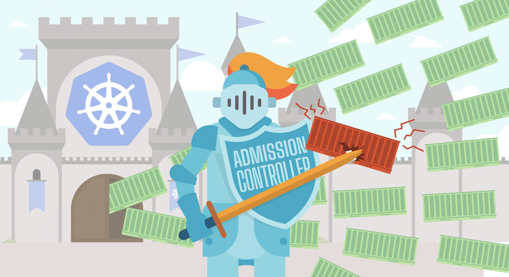

# Admission Webhook

> [Dynamic Admission Control](https://kubernetes.io/docs/reference/access-authn-authz/extensible-admission-controllers/)

- [Admission Webhook](#admission-webhook)
  - [写在前面](#写在前面)
  - [Admission controllers](#admission-controllers)
  - [Why need admission controllers](#why-need-admission-controllers)
  - [Which plugins(admission controllers) are enabled by default](#which-pluginsadmission-controllers-are-enabled-by-default)
  - [What are admission webhooks](#what-are-admission-webhooks)
  - [Reference To](#reference-to)

## 写在前面

在我们聊 __Admission Webhook__ 之前先聊聊Admission controllers.

## Admission controllers

Admission controllers are a powerful Kubernetes-native feature that helps you define and customize what is allowed to run on your cluster.



A Kubernetes admission controller is code that evaluates requests to the Kubernetes API server, then determines whether or not to allow the request.

The evaluation happens after the API server has already authenticated and authorized the request, but before the request is granted and implemented.

In other words, even if the API server has determined a request to be valid (which it would do based on the RBAC Roles and ClusterRoles you have set up), admission controllers will evaluate the request and make a determination about whether or not to accept it based on their own set of rules.

## Why need admission controllers

Many advanced features in Kubernetes require an admission controller to be enabled in order to properly support the feature. As a result, a Kubernetes API server that is not properly configured with the right set of admission controllers is an incomplete server and will not support all the features you expect.

For example, they can mitigate denial of service (DoS) attacks on multitenant clusters. Consider the [`LimitRanger`](https://kubernetes.io/docs/reference/access-authn-authz/admission-controllers/#limitranger) plugin, which — as the name suggests — enforces limit ranges. `LimitRanger` define mandatory ranges of resource consumption on a per-namespace basis(在每个命名空间的基础上定义资源消耗的强制性范围). This prevents tenants from depleting one another’s resources(这可以防止租户彼此耗尽资源). [LimitRanger相关的代码](https://github.com/kubernetes/kubernetes/blob/v1.26.0-alpha.2/plugin/pkg/admission/limitranger/admission.go#L441)

## Which plugins(admission controllers) are enabled by default

The recommended admission controllers are enabled by default, so you do not need to explicitly specify them. You can enable additional admission controllers beyond the default set using the `--enable-admission-plugins` flag (order doesn't matter).

```sh
kube-apiserver -h | grep enable-admission-plugins

# 如果你的kube-apiserver是pod类型启动的，可以执行如下命令查看：
kubectl -n kube-system exec -it kube-apiserver-pod-name -- kube-apiserver -h |grep enable-admission-plugins
```

* In the v1.20.11, the default ones are:

```sh
NamespaceLifecycle, LimitRanger, ServiceAccount, TaintNodesByCondition, Priority, DefaultTolerationSeconds, DefaultStorageClass, StorageObjectInUseProtection, PersistentVolumeClaimResize, RuntimeClass, CertificateApproval, CertificateSigning, CertificateSubjectRestriction, DefaultIngressClass, MutatingAdmissionWebhook, ValidatingAdmissionWebhook, ResourceQuota
```

## What are admission webhooks

Admission webhooks are HTTP callbacks that receive admission requests and do something with them. You can define two types of admission webhooks, [validating admission webhook](https://kubernetes.io/docs/reference/access-authn-authz/admission-controllers/#validatingadmissionwebhook) and [mutating admission webhook](https://kubernetes.io/docs/reference/access-authn-authz/admission-controllers/#mutatingadmissionwebhook). Mutating admission webhooks are invoked first, and can modify objects sent to the API server to enforce custom defaults. After all object modifications are complete, and after the incoming object is validated by the API server, validating admission webhooks are invoked and can reject requests to enforce custom policies.


__Note__:  如果 Admission Webhook 需要保证它们所看到的是对象的最终状态以实施某种策略。刚应该使用 validating admission webhook, 因为对象被 mutating Webhook 看到之后仍然可能被修改.

## Reference To

1. <https://sysdig.com/blog/kubernetes-admission-controllers/>
