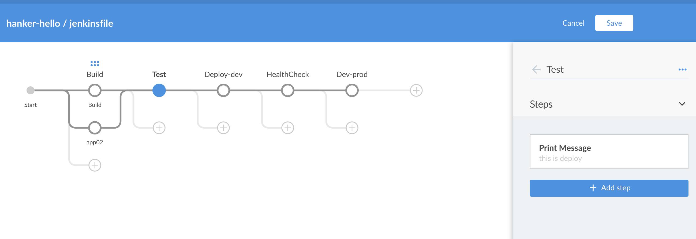

# 如何写好 Jenkinsfile | Jenkins Pipeline


[](https://www.linkedin.com/in/colynn/)
[](https://twitter.com/colynnliu)
 

## 前置条件
* jenkins
* jenkins plugins (pipeline/blue occean)

 https://www.jenkins.io/doc/book/using/
 
## What is Pipeline / Jenkinsfile


## 为什么需要 pipeline

我们均知道 Jenkins是一个支持多种自动化模式的自动化引擎。 Pipeline在Jenkins上添加了一套强大的自动化工具，支持从简单的持续集成到全面的CD管道的用例。 通过对一系列相关任务进行建模。


## Pipeline concepts

* Pipeline
* Node
* Stage
* Step


`Pipeline` 下支持 `Parallel`, `Node`不支持`Parallel`


## Pipeline Syntax

### 1. Declarative Pipeline

```Jenkinsfile
pipeline {
    /* insert Declarative Pipeline here */
}
```

### 2. Scripted Pipeline

```Jenkinsfile
node {
    stage('Example') {
        if (env.BRANCH_NAME == 'master') {
            echo 'I only execute on the master branch'
        } else {
            echo 'I execute elsewhere'
        }
    }
}
```

### 3. Synatx Comparison
__Scripted Pipeline__ offers a tremendous amount of flexibility and extensibility to Jenkins users. The Groovy learning-curve isn’t typically desirable for all members of a given team, so __Declarative Pipeline__ was created to offer a simpler and more opinionated syntax for authoring Jenkins Pipeline.


### 4. Use Pipeline through API
* https://github.com/go-atomci/workflow

### 5. Use Pipeline through Blue Occean


## Jenkinsfile work with Kubernetes plugin

[Kubernetes plugin for Jenkins GitHub](https://github.com/jenkinsci/kubernetes-plugin/blob/master/README.md)

[Kubernetes plugin docs](https://www.jenkins.io/doc/pipeline/steps/kubernetes/#kubernetes-plugin)


## Refer to
1. https://www.jenkins.io/doc/book/pipeline/syntax/#declarative-pipeline